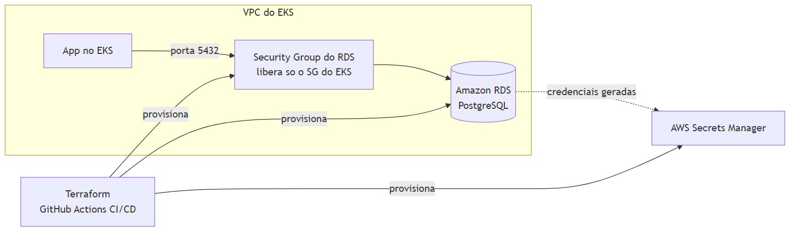
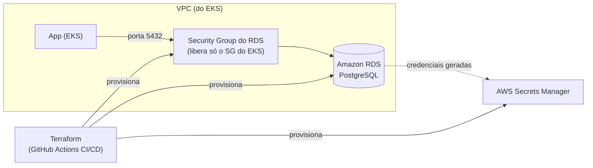

# tech-challenge-infra-db

Infraestrutura como código (Terraform) do banco de dados gerenciado do **Tech Challenge — Fase 3**.

## Propósito

Provisiona uma instância Amazon RDS PostgreSQL para a aplicação principal, com:

- geração de senha aleatória (`random_password`)
- armazenamento de credenciais no AWS Secrets Manager
- subnet group para subnets privadas
- security group liberando acesso apenas para o SG do EKS (porta 5432)
- parameter group com ajustes de log

Este repositório **não** contém migrations nem código da aplicação.

## Tecnologias

- Terraform (required_version `>= 1.5`)
- Providers: `hashicorp/aws` (`~> 5.0`) e `hashicorp/random` (`~> 3.6`)
- Amazon RDS for PostgreSQL
- AWS Secrets Manager
- GitHub Actions

## Arquitetura deste repositório



<details>
<summary>Fonte editável do diagrama (Mermaid)</summary>



</details>

## Documentação relacionada

- [Justificativa Escolha do Banco de Dados](./docs/Justificativa-Formal-Escolha-do-Banco-de-Dados.md) — explica por que PostgreSQL e Amazon RDS foram escolhidos para este projeto.
- [Modelo Relacional e Diagrama](./docs/Modelo-Relacional-e-Diagrama-ER.md) — descreve o modelo relacional do banco e inclui o diagrama correspondente.
- [RFC-0001](./docs/RFC-0001-banco-de-dados.md) — detalha a decisão de usar RDS em vez de Postgres em pod no EKS.
- [ADR-0001](./docs/ADR-0001-banco-de-dados-gerenciado.md) — detalha a decisão de usar um banco de dados gerenciado (RDS) em vez de gerenciar o PostgreSQL no EKS.


## Pré-requisitos

- VPC e subnets privadas já existentes
- Security Group do EKS (ou dos nodes/pods que acessam o banco)
- Bucket S3 para backend remoto do Terraform
- Credenciais AWS com permissão para RDS, Security Group, Subnet Group e Secrets Manager

## Execução local

```bash
# 1) Criar arquivo de variáveis
cp terraform.tfvars.example terraform.tfvars
# No Windows PowerShell, alternativa:
# Copy-Item terraform.tfvars.example terraform.tfvars

# Preencher no terraform.tfvars (obrigatórias):
# - vpc_id = "vpc-..."
# - private_subnet_ids = ["subnet-...","subnet-..."]
# - eks_security_group_id = "sg-..."
# As demais variáveis já têm default em variables.tf

# 2) Inicializar backend e providers
terraform init -backend-config="bucket=<NOME_DO_BUCKET>"

# 3) Qualidade e plano
terraform fmt -check -recursive
terraform validate
terraform plan

# 4) Aplicar
terraform apply
```

## CI/CD (GitHub Actions)

Workflow: `.github/workflows/terraform.yml`

- **Pull Request para `main`**: executa `terraform fmt -check`, `terraform validate` e `terraform plan`
- **Push/Merge em `main`**: executa `terraform apply -auto-approve`

### Secrets necessários no GitHub Actions

| Secret | Descrição |
|---|---|
| `AWS_ACCESS_KEY_ID` | Credencial AWS |
| `AWS_SECRET_ACCESS_KEY` | Credencial AWS |
| `AWS_SESSION_TOKEN` | Token de sessão AWS (quando aplicável) |
| `TF_BACKEND_BUCKET` | Nome do bucket S3 do backend Terraform |
| `VPC_ID` | VPC onde o RDS será criado |
| `PRIVATE_SUBNET_IDS` | Lista de subnets privadas no formato Terraform (ex.: `["subnet-a","subnet-b"]`) |
| `EKS_SECURITY_GROUP_ID` | Security Group do EKS autorizado no banco |

## Destruição da infraestrutura

```bash
terraform destroy
```

## Ambiente ativo (deploy)

Este repositório não expõe uma URL pública — o "deploy" é a instância RDS provisionada na conta AWS do projeto. Para verificar/consumir o ambiente ativo:

```bash
terraform output
```

Isso retorna `db_endpoint`, `db_address`, `db_port`, `db_name` e `secrets_manager_secret_arn` da instância atualmente provisionada (ver seção "Outputs" abaixo).

## Outputs para consumo por outros repositórios

- `db_endpoint` — endpoint completo (host:port)
- `db_address` — host do banco
- `db_port` — porta do banco
- `db_name` — nome do banco
- `db_security_group_id` — SG criado para o banco
- `secrets_manager_secret_arn` — ARN do secret com credenciais

## Como o app (rodando no EKS) deve se conectar ao banco

O RDS **não roda dentro do cluster EKS** — é um serviço gerenciado pela AWS, acessível pela rede da VPC. O pod da aplicação se conecta a ele via rede, usando host/porta/credenciais, exatamente como conectaria a qualquer Postgres externo.

Passos recomendados para quem for integrar:

1. **Obter host, porta e nome do banco**: rodar `terraform output` neste repositório (ou consumir via `terraform_remote_state` a partir do repositório do app) para pegar `db_endpoint`, `db_address`, `db_port` e `db_name`.
2. **Obter usuário e senha**: buscar o secret gerado no AWS Secrets Manager, cujo ARN é o output `secrets_manager_secret_arn`. O secret contém `username`, `password`, `engine`, `host`, `port` e `dbname` em JSON.
   ```bash
   aws secretsmanager get-secret-value --secret-id <ARN_DO_SECRET> --query SecretString --output text
   ```
3. **Expor essas credenciais para o pod**, por exemplo com um `Secret` do Kubernetes (populado via [External Secrets Operator](https://external-secrets.io/) apontando para o Secrets Manager, ou copiado manualmente para um `Secret` nativo) e referenciado como variáveis de ambiente/`envFrom` no `Deployment` da aplicação.
4. **Garantir acesso de rede**: o Security Group do banco (`db_security_group_id`) só libera a porta 5432 para o Security Group do EKS informado em `eks_security_group_id`. Se o app rodar em outro SG/nodegroup, é preciso atualizar essa variável e reaplicar o Terraform.

Isso evita hardcode de credenciais no manifesto do app e mantém a rotação de senha centralizada no Secrets Manager.

## Observação

Este repositório não expõe API. Portanto, Swagger/Postman não se aplicam aqui.
