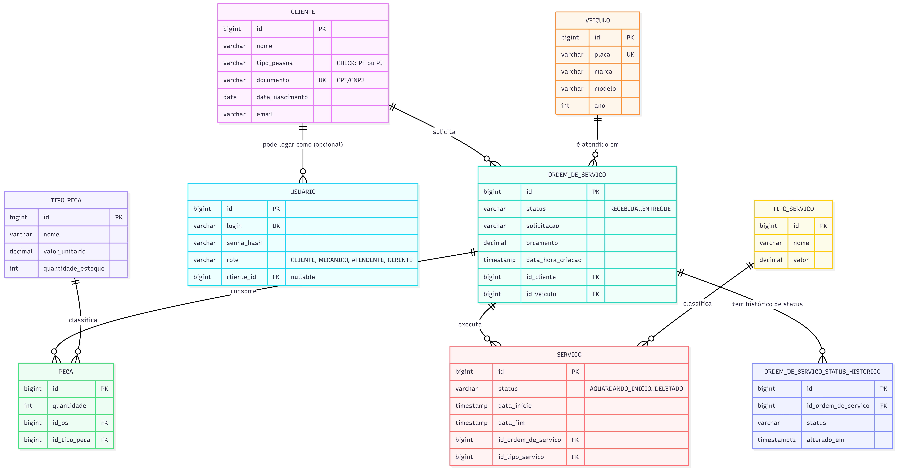
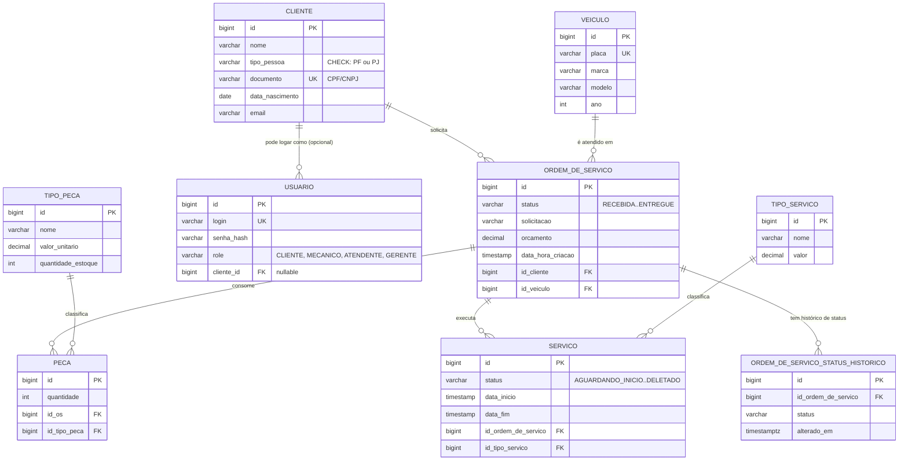

# Modelo Relacional e Diagrama ER

| Campo   | Valor                                                                                                                                                                                    |
|---------|------------------------------------------------------------------------------------------------------------------------------------------------------------------------------------------|
| Projeto | Tech Challenge — Sistema de Ordem de Serviço de Oficina Mecânica                                                                                                                         |
| Repositórios relacionados | [`tech-challenge-app`](https://github.com/Thiarges/tech-challenge-app) (aplicação) e [`tech-challenge-infra-db`](https://github.com/theodirk21/tech-challenge-infra-db) (infraestrutura) |
| Data    | 31-08-2026                                                                                                                                                                               |
| Autor   | Theo Dirk                                                                                                                                                                                |

## 1. Diagrama Entidade-Relacionamento (ER)

Modelo extraído das migrations Flyway (`V001` a `V016`) e das entidades JPA da aplicação (`tech-challenge-app`), considerando a evolução do schema relacional usada atualmente pela aplicação:

Fonte editável do diagrama (Mermaid)

## 2. Explicação dos relacionamentos

### 2.1 `cliente` (1) — (N) `ordem_de_servico`
Um cliente pode possuir várias Ordens de Serviço ao longo do tempo; cada OS pertence a exatamente um cliente. FK: `ordem_de_servico.id_cliente → cliente.id` (`fk_os_cliente`).

### 2.2 `veiculo` (1) — (N) `ordem_de_servico`
Um veículo pode passar por várias Ordens de Serviço (histórico de manutenção); cada OS refere-se a exatamente um veículo. FK: `ordem_de_servico.id_veiculo → veiculo.id` (`fk_os_veiculo`).

### 2.3 `ordem_de_servico` (1) — (N) `peca`
Uma Ordem de Serviço pode consumir várias peças; cada registro de `peca` pertence a exatamente uma OS. FK: `peca.id_os → ordem_de_servico.id` (`fk_peca_os`), `NOT NULL` (peça não existe sem OS).

### 2.4 `tipo_peca` (1) — (N) `peca`
`tipo_peca` é um **catálogo** (nome, valor unitário, estoque). Cada linha de `peca` referencia um tipo, permitindo reaproveitar o mesmo tipo de peça em múltiplas OS sem duplicar nome/preço. FK: `peca.id_tipo_peca → tipo_peca.id` (`fk_peca_tipo_peca`), `NOT NULL`.

### 2.5 `ordem_de_servico` (1) — (N) `servico`
Uma OS pode ter vários serviços executados (ex.: troca de óleo + alinhamento); cada `servico` pertence a exatamente uma OS. FK: `servico.id_ordem_de_servico → ordem_de_servico.id`, `NOT NULL`.

### 2.6 `tipo_servico` (1) — (N) `servico`
Assim como `tipo_peca`, `tipo_servico` é um catálogo (nome, valor) reaproveitado por múltiplos registros de `servico`. FK: `servico.id_tipo_servico → tipo_servico.id`, `NOT NULL`.

### 2.7 `cliente` (1) — (0..N) `usuario` — relacionamento opcional
Nem todo usuário do sistema é um cliente (mecânico, atendente e gerente também logam, mas não têm vínculo com `cliente`). Por isso a FK é **opcional**: `usuario.cliente_id → cliente.id`, com `ON DELETE SET NULL` — se o cliente for removido, o usuário não é apagado, apenas perde o vínculo.

### 2.8 `ordem_de_servico` (1) — (N) `ordem_de_servico_status_historico`
Cada mudança relevante de status da OS pode ser registrada em histórico, preservando rastreabilidade temporal. A FK atual é `ordem_de_servico_status_historico.id_ordem_de_servico → ordem_de_servico.id`, com exclusão em cascata (`ON DELETE CASCADE`) para remover o histórico quando a OS for excluída.

## Referências
- Migrations: [`tech-challenge-app`](https://github.com/Thiarges/tech-challenge-app) — `app/src/main/resources/db/migration/V001` a `V016`.
- [`Justificativa da escolha do banco`](./Justificativa-Formal-Escolha-do-Banco-de-Dados.md).
